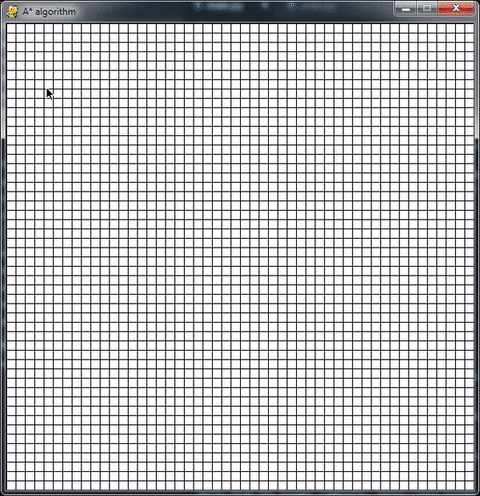

# A-Visualization

This project shows the visualization of shortest path finding algorithm A*.

The only pre-requisite is Python version 3 be installed and pygame library to be installed.

To run the project download the repo and from the downloaded directory, type this command:

python main.py

Steps:

1. First click anywhere on the grid for the start node, shown in orange color
2. Then click anywhere on the grid for the end node, shown in blue color
3. Then you can draw walls by clicking and dragging across the grid
4. Press space bar on the keyboard for the algorithm to run
5. To clear the window press the key 'c' on the keyboard
